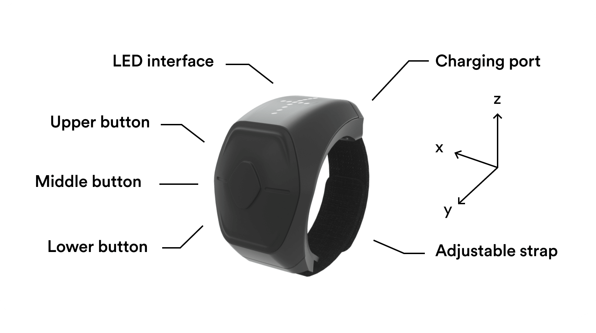

# Wave by Genki
[Wave](https://genkiinstruments.com/wave) is a unique smart ring manufactured and maintained by [Genki](https://genkiinstruments.com/wave).
This repository contains the official Python API interface for [Wave](https://genkiinstruments.com/wave), arguably the easiest way to work with data from motion sensors in Python.

The API provides access to Wave's onboard sensor data, as well as processed motion data using proprietary
algorithms in an accessible form factor. 

For more details, please refer to the
[technical documentation](https://www.notion.so/genkiinstruments/Wave-API-8a91bd3553ee4529878342dec477d93f).



# Installation
This package has been tested with `python 3.8` on both macOS and Linux. Installation is straight forward.

```bash
python -m pip install genki-wave
```

*Note that [bluez](http://www.bluez.org/) is a requirement on Linux-based systems.*

## Setting up the Wave ring
Make sure you've installed the latest firmware on your Wave by following
[these instructions](https://www.notion.so/genkiinstruments/Wave-Manual-Firmware-Update-87ce5d60ff94492dadcfe4c406192b5b).

To turn Wave on press the middle button, to turn it off hold the top and bottom buttons
down for one second.

Refer to the [technical documentation](https://www.notion.so/genkiinstruments/Wave-API-8a91bd3553ee4529878342dec477d93f)
for a detailed overview of how to use and interface with the API.

# Quickstart
## General
Turn Wave on and make sure it is not connected. To find the Bluetooth address of the nearest Wave, run the following

```python
from genki_wave.discover import run_discover_bluetooth

run_discover_bluetooth()
```

And the following example uses a callback that prints out which button has been pressed, along with the sensor reading
every 5 seconds.

```python
from genki_wave.asyncio_runner import run_asyncio_bluetooth
from genki_wave.callbacks import ButtonAndDataPrint

callbacks = [ButtonAndDataPrint(print_data_every_n_seconds=5)]
ble_address = ""  # Address of the Wave ring, found in the previous step
run_asyncio_bluetooth(callbacks, ble_address)
```

Further examples are in the [examples](https://github.com/genkiinstruments/genki-wave/blob/master/examples) folder.

## MIDI
The simples way to start is connecting Wave as a BLE MIDI device and running
[examples/run_midi.py](https://github.com/genkiinstruments/genki-wave/blob/master/examples/run_midi.py).
This example only depends on [pygame](https://www.pygame.org) and allows you to receive data from Wave in
[standalone mode](https://genkiinstrumentshelp.zendesk.com/hc/en-us/sections/360003976117-Standalone-mode).

# Known issues
* [bleak](https://github.com/hbldh/bleak) the Python Bluetooth library, can only connect to devices that are *not*
  connected to the computer. After pairing Wave to a Linux machine Wave tends to connect automatically quite
  aggressively and cannot be accessed via bleak. One solution is to use `bluetoothctl` to disconnect before pairing
  with `genki-wave`.
* Wave needs to be off and disconnected before receiving any data via the serial port.
* There is an error when you have Wave connected via Bluetooth and use `asyncio` to receive data.
  If you kill the program, e.g., with a keyboard interrupt, Wave stays connected and has an invalid state.
  For the time being you can hold the top button for a few seconds to properly exit the program.
